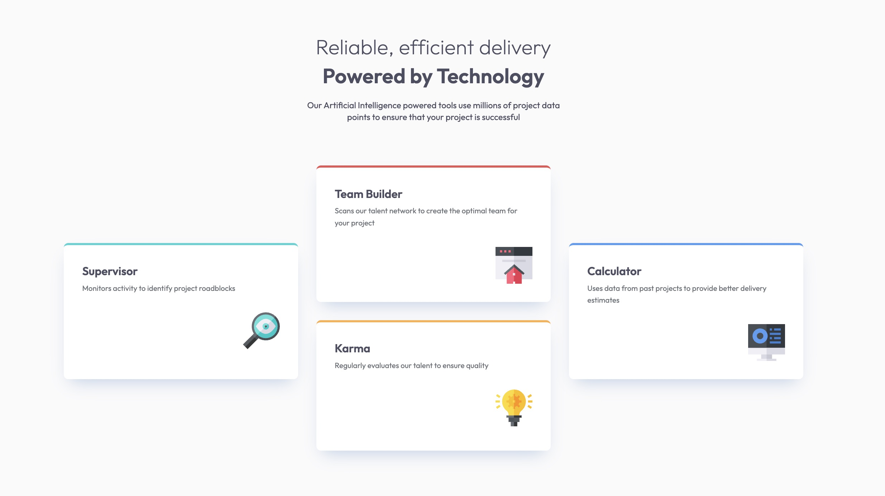

# Frontend Mentor - Four card feature solution

This is a solution to the [Four card feature challenge on Frontend Mentor](https://www.frontendmentor.io/challenges/four-card-feature-section-weK1eFYK).

## Table of contents

- [Screenshot](#screenshot)
- [Links](#links)
- [Built with](#built-with)
- [Useful resources](#useful-resources)
- [Author](#author)

### Screenshot

### Links

- Repo URL: [https://github.com/joparke/four-card-feature-section](https://github.com/joparke/four-card-feature-section)

- Live Site URL: [https://joparke.github.io/product-preview-card/](https://joparke.github.io/product-preview-card/)

### Built with

- HTML5 markup
- CSS custom properties
- Flexbox & CSS grid
- Picalilli CSS reset
- VS Code

### Useful resources

- [Piccalilli CSS reset](https://piccalil.li/blog/a-more-modern-css-reset/) - Utilized this CSS reset

## Author

- Frontend Mentor - [@joparke](https://www.frontendmentor.io/profile/joparke)
